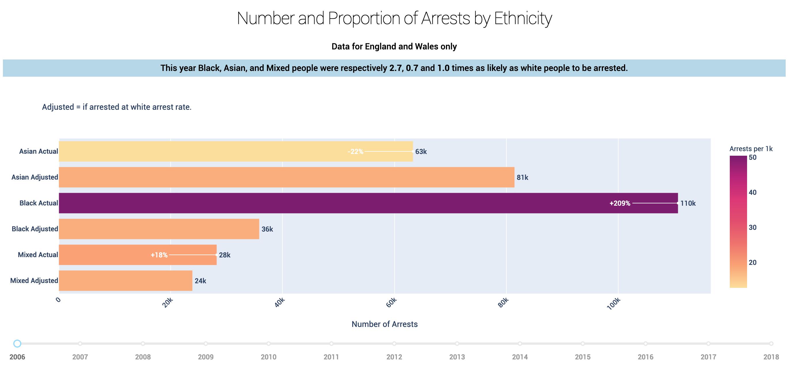
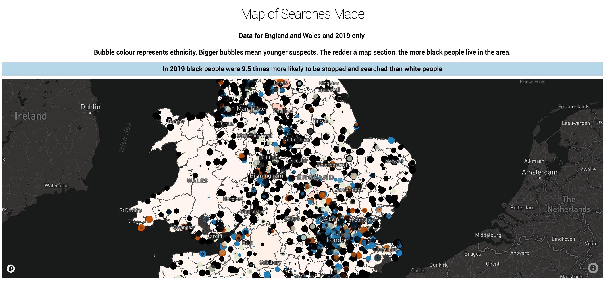
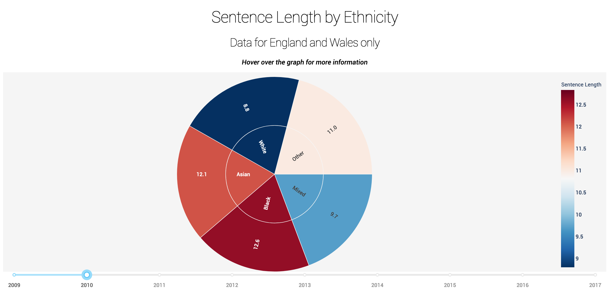

[](https://www.python.org/)
[](http://ForTheBadge.com)
[](https://forthebadge.com)
# Black Lives Matter - Web App
> An interactive data dashboard examining structural racism in Britain. See it in action at 
>[blmjusticeapp.co.uk](https://urlgoeshere.com).
>






## Table of contents
* [General info](#general-info)
* [Technologies](#technologies)
* [Setup](#setup)
* [Features](#features)
* [Data Sources](#sources)
* [Inspiration](#inspiration)
* [Contact](#contact)

## General info
This app has been made in response to the UK government's disappointing reaction to recent Black Lives Matter protests
in Britain. The government's principal response to these protests was to set up a UK race inequality commission.

However the head of the commission has previously doubted the existence of institutional racism in the UK. This app 
uses data to question that decision.

## Technologies
* Python 3.8
* Dash 
* Plotly 
* Pandas
* Requests
* Pytest
* Selenium

## Access UK Police Data
This web app uses stop and search data from the UK Police's public API. You can access this using the script 
get-stopsearch-data.py in this repository.

To do so clone this repository and then install pandas, requests, and tenacity.

If you want to access results based on geojson co-ordinates for local area districts then you should download the file
'formatted_UK_LAD.geojson' in the data folder of this repository.

This file was created from the geojson source in the sources section below using the 'format-geojson.py' script in this 
repository.

## Code Examples
To run the 'get-stopsearch-data.py' script:

```
python get-stopsearch-data.py -h
usage: get-stopsearch-data.py [-h] [--lad] [--date] [--range] [--merge]

optional arguments:
  -h, --help  show this help message and exit
  --lad       For stop and searches in one local area district.
  --date      For stop and searches in all local area districts on the same date.
  --range     For stop and searches in all local area districts on a range of dates.
  --merge     Join results from differen months together. Only works with output from the --range argument.
```

## Features
* Multi-tab Dash app
* Plotly scattermapbox plot layered on top of a choropleth map graph object
* Interactive plotly express sunburst chart
* Interactive plotly express bar chart

## Sources
[Police Data](https://data.police.uk/.), [UK Government Ethnicity Facts and Figures](https://www.ethnicity-facts-figures.service.gov.uk)
, [UK Government Arrests Data](https://assets.publishing.service.gov.uk/government/uploads/system/uploads/attachment_data/file/841253/arrest-police-powers-procedures-mar19-hosb2519-tables.ods)
, [Office of National Statistics Population Data](https://www.ons.gov.uk/file?uri=%2fpeoplepopulationandcommunity%2fpopulationandmigration%2fpopulationestimates%2fdatasets%2fpopulationestimatesforukenglandandwalesscotlandandnorthernireland%2fmid2001tomid2018detailedtimeseries/ukpopulationestimates18382018.xlsx)
, [UK Local Area District Co-Ordinates](https://github.com/martinjc/UK-GeoJSON).

## Inspiration
Based on a COVID-19 app by my friend and WHO data scientist [Gideon Wakefield](https://github.com/wakefieldg).

## Contact
Created by Alex Darby - feel free to contact me on os1ntal3x@gmail.com !